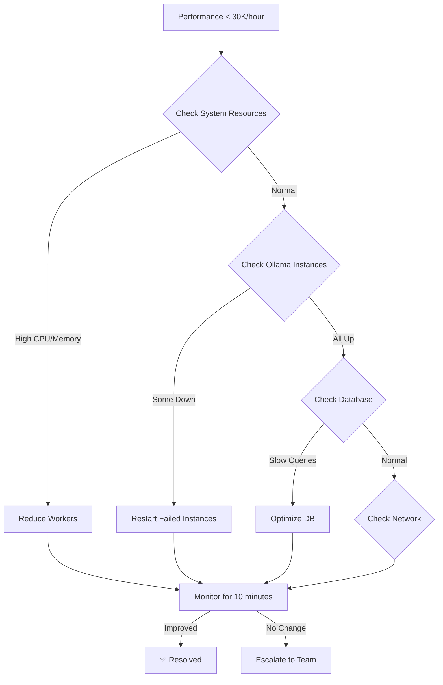
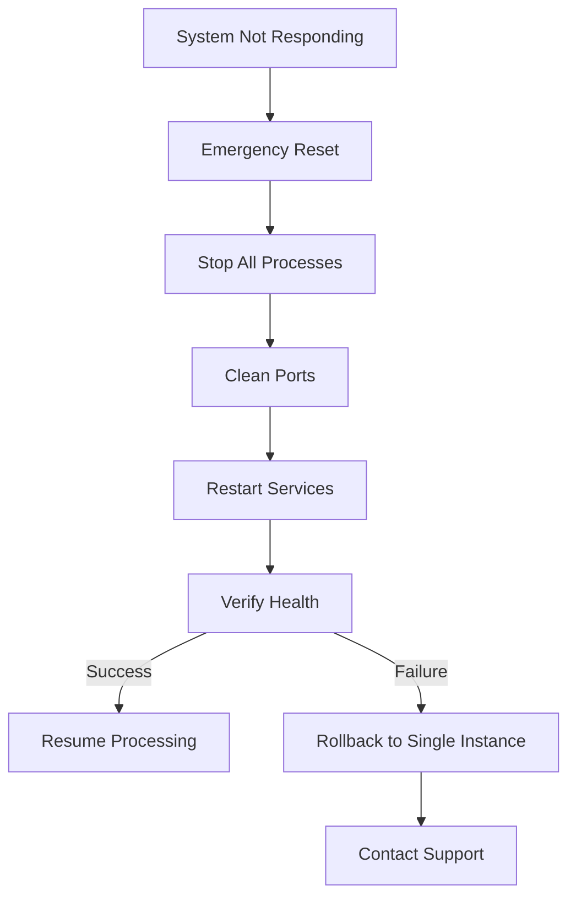

# 🚨 Embedding Pipeline Troubleshooting Guide

## 🎯 Overview
Comprehensive troubleshooting guide for LibraryOfBabel's embedding pipeline. Covers common issues, diagnostic procedures, and recovery strategies.

**📋 Confluence Documentation**: [Embedding Pipeline Troubleshooting](https://libraryofbabel.atlassian.net/wiki/spaces/TECH/pages/troubleshooting)

---

## 🚦 Quick Diagnostic Checklist

### Essential Health Checks
```bash
# 1. Check Ollama instances
ps aux | grep ollama | grep -v grep

# 2. Verify models loaded
for port in 11434 11435 11436; do
  curl -s http://localhost:$port/api/ps | jq '.models[].name'
done

# 3. Check daemon status
ps aux | grep multi_ollama_bge_daemon

# 4. Database connectivity
psql -d knowledge_base -c "SELECT 1;"

# 5. System resources
top -l 1 | grep "CPU usage"
vm_stat | head -5
```

### Quick Status Summary
```bash
#!/bin/bash
# quick_health_check.sh

echo "🩺 LibraryOfBabel Embedding Pipeline Health Check"
echo "==============================================="

# Ollama instances
echo "🔍 Ollama Instances:"
OLLAMA_COUNT=$(ps aux | grep ollama | grep -v grep | wc -l)
echo "  Running: $OLLAMA_COUNT/3"

# Models loaded
echo "🧠 Models:"
for port in 11434 11435 11436; do
  MODEL=$(curl -s http://localhost:$port/api/ps 2>/dev/null | jq -r '.models[0].name // "not loaded"')
  echo "  Port $port: $MODEL"
done

# Daemon status
echo "⚙️ Daemon:"
if pgrep -f multi_ollama_bge_daemon > /dev/null; then
  echo "  ✅ Multi-Ollama daemon running"
else
  echo "  ❌ Multi-Ollama daemon not running"
fi

# Database
echo "🗄️ Database:"
if psql -d knowledge_base -c "SELECT 1;" &>/dev/null; then
  echo "  ✅ PostgreSQL accessible"
else
  echo "  ❌ PostgreSQL connection failed"
fi
```

**🚦 Quick Diagnostics**: [Health Check Scripts](https://libraryofbabel.atlassian.net/wiki/spaces/TECH/pages/health-checks)

---

## 🚨 Common Issues & Solutions

### 1. Ollama Instance Problems

#### Issue: Ollama Won't Start on Alternative Ports
**Symptoms**:
```bash
$ OLLAMA_HOST=127.0.0.1:11435 ollama serve
Error: listen tcp 127.0.0.1:11435: bind: address already in use
```

**Diagnosis**:
```bash
# Check what's using the port
lsof -i :11435
netstat -an | grep 11435

# Check for existing Ollama processes
ps aux | grep ollama
```

**Solutions**:
```bash
# Solution 1: Kill existing process
kill -9 $(lsof -ti :11435)

# Solution 2: Use different port
OLLAMA_HOST=127.0.0.1:11437 ollama serve

# Solution 3: Clean restart all Ollama processes
pkill -f ollama
sleep 5
ollama serve &
OLLAMA_HOST=127.0.0.1:11435 ollama serve &
OLLAMA_HOST=127.0.0.1:11436 ollama serve &
```

**🔧 Ollama Issues Guide**: [Ollama Instance Troubleshooting](https://libraryofbabel.atlassian.net/wiki/spaces/TECH/pages/ollama-troubleshooting)

#### Issue: Model Loading Failures
**Symptoms**:
```bash
curl: (7) Failed to connect to localhost port 11435: Connection refused
```

**Diagnosis**:
```bash
# Check instance status
curl -s http://localhost:11435/api/ps

# Check disk space
df -h ~/.ollama

# Check model cache
ls -la ~/.ollama/models/
```

**Solutions**:
```bash
# Solution 1: Wait for startup (models load slowly)
sleep 30
curl -s http://localhost:11435/api/ps

# Solution 2: Clear model cache
rm -rf ~/.ollama/models/blobs/*
ollama pull bge-m3

# Solution 3: Manual model load
curl -X POST http://localhost:11435/api/pull \
  -H "Content-Type: application/json" \
  -d '{"name":"bge-m3"}'
```

### 2. Database Connection Issues

#### Issue: PostgreSQL Connection Failures
**Symptoms**:
```python
psycopg2.OperationalError: could not connect to server
```

**Diagnosis**:
```bash
# Check PostgreSQL service
brew services list | grep postgresql

# Test connection manually
psql -d knowledge_base -c "SELECT current_user;"

# Check database configuration
grep -A5 "db_config" multi_ollama_bge_daemon.py
```

**Solutions**:
```bash
# Solution 1: Start PostgreSQL
brew services start postgresql

# Solution 2: Check database exists
psql -l | grep knowledge_base

# Solution 3: Create database if missing
createdb knowledge_base

# Solution 4: Check user permissions
psql -d knowledge_base -c "SELECT current_user, session_user;"
```

**🗄️ Database Issues Guide**: [Database Connection Troubleshooting](https://libraryofbabel.atlassian.net/wiki/spaces/TECH/pages/database-troubleshooting)

#### Issue: Permission Denied on Database Operations
**Symptoms**:
```sql
ERROR: permission denied for table chunk_embeddings
```

**Solutions**:
```sql
-- Grant necessary permissions
GRANT ALL PRIVILEGES ON TABLE chunk_embeddings TO weixiangzhang;
GRANT USAGE, SELECT ON ALL SEQUENCES IN SCHEMA public TO weixiangzhang;

-- Check current permissions
\dp chunk_embeddings
```

### 3. Performance Issues

#### Issue: Low Embedding Generation Rate
**Symptoms**:
- Processing rate < 30K embeddings/hour
- High CPU but low throughput
- Workers frequently idle

**Diagnosis**:
```bash
# Check worker utilization
tail -f multi_ollama_beast.log | grep "Processing"

# Monitor system resources
top -pid $(pgrep multi_ollama_bge_daemon)

# Check Ollama response times
time curl -X POST http://localhost:11434/api/embeddings \
  -d '{"model":"bge-m3","prompt":"test"}'
```

**Solutions**:
```python
# Solution 1: Reduce worker count (memory pressure)
python3 multi_ollama_bge_daemon.py 30  # Down from 42

# Solution 2: Increase batch size
# Edit daemon: self.batch_size = self.current_workers * 8  # Up from 6

# Solution 3: Check for memory swapping
vm_stat | grep "Swapouts"
# If swapouts > 0, reduce workers or add RAM
```

**📊 Performance Issues Guide**: [Performance Troubleshooting](https://libraryofbabel.atlassian.net/wiki/spaces/TECH/pages/performance-troubleshooting)

#### Issue: Memory Pressure/Out of Memory
**Symptoms**:
- Frequent swapping
- Ollama crashes
- System becomes unresponsive

**Diagnosis**:
```bash
# Check memory usage
vm_stat | head -10
top -l 1 | grep "PhysMem"

# Check for memory leaks
leaks -nocontext $(pgrep multi_ollama_bge_daemon)
```

**Solutions**:
```bash
# Solution 1: Reduce workers
python3 multi_ollama_bge_daemon.py 24

# Solution 2: Restart Ollama instances (clear cache)
pkill -f ollama
sleep 10
# Restart following multi-ollama setup

# Solution 3: Adjust batch processing
# Edit daemon to process smaller batches
```

### 4. Network & Connectivity Issues

#### Issue: API Timeouts
**Symptoms**:
```python
requests.exceptions.Timeout: HTTPSConnectionPool: Read timed out
```

**Diagnosis**:
```bash
# Test network latency
ping localhost
time curl -s http://localhost:11434/api/ps

# Check system load
uptime
```

**Solutions**:
```python
# Solution 1: Increase timeout in daemon
self.timeout_seconds = 60  # Up from 30

# Solution 2: Add retry logic
self.retry_attempts = 5  # Up from 3

# Solution 3: Implement exponential backoff
self.retry_delay = min(self.retry_delay * 2, 30)
```

**🌐 Network Issues Guide**: [Network Troubleshooting](https://libraryofbabel.atlassian.net/wiki/spaces/TECH/pages/network-troubleshooting)

---

## ⚡ Emergency Recovery Procedures

### Complete System Reset

#### Nuclear Option: Full Pipeline Restart
```bash
#!/bin/bash
# emergency_reset.sh

echo "🚨 EMERGENCY PIPELINE RESET"
echo "=========================="

# 1. Stop all processes
echo "🛑 Stopping all processes..."
pkill -f ollama
pkill -f multi_ollama_bge_daemon
sleep 10

# 2. Clear any stuck processes
echo "🧹 Cleaning up..."
pkill -9 -f ollama
pkill -9 -f multi_ollama_bge_daemon

# 3. Check for port conflicts
echo "🔍 Checking ports..."
for port in 11434 11435 11436; do
  if lsof -i :$port; then
    echo "  Killing process on port $port"
    kill -9 $(lsof -ti :$port)
  fi
done

# 4. Restart PostgreSQL
echo "🗄️ Restarting PostgreSQL..."
brew services restart postgresql
sleep 5

# 5. Start Ollama instances
echo "🚀 Starting Ollama instances..."
ollama serve > /dev/null 2>&1 &
sleep 3
OLLAMA_HOST=127.0.0.1:11435 ollama serve > /dev/null 2>&1 &
sleep 3  
OLLAMA_HOST=127.0.0.1:11436 ollama serve > /dev/null 2>&1 &
sleep 10

# 6. Load models
echo "📥 Loading models..."
ollama pull bge-m3
for port in 11435 11436; do
  curl -s -X POST http://localhost:$port/api/pull -d '{"name":"bge-m3"}' > /dev/null
done

# 7. Verify setup
echo "🔍 Verifying setup..."
./quick_health_check.sh

echo "✅ Emergency reset complete!"
```

#### Rollback to Single Instance
```bash
#!/bin/bash
# rollback_single_instance.sh

echo "🔄 Rolling back to single Ollama instance"

# Stop multi-instance setup
pkill -f ollama
pkill -f multi_ollama_bge_daemon

# Start single instance
ollama serve &
sleep 5

# Load model
ollama pull bge-m3

# Start single-instance daemon (fallback)
cd archive/2025_Q3_august_cleanup/test_scripts/
python3 multi_threaded_bge_daemon.py 30

echo "✅ Rollback to single instance complete"
```

**🚨 Emergency Procedures**: [Emergency Recovery Guide](https://libraryofbabel.atlassian.net/wiki/spaces/TECH/pages/emergency-recovery)

---

## 🔧 Diagnostic Tools & Scripts

### Comprehensive Diagnostic Script

#### `diagnose_embedding_pipeline.py`
```python
#!/usr/bin/env python3
"""
🔍 Comprehensive Embedding Pipeline Diagnostics
==============================================
Diagnoses all aspects of the embedding pipeline.
"""

import requests
import psycopg2
import subprocess
import json
import time
from datetime import datetime

class PipelineDiagnostics:
    def __init__(self):
        self.ollama_ports = [11434, 11435, 11436]
        self.db_config = {
            'host': 'localhost',
            'database': 'knowledge_base', 
            'user': 'weixiangzhang',
            'port': 5432
        }
        
    def diagnose_ollama_instances(self):
        """Diagnose Ollama instance health"""
        print("🔍 OLLAMA INSTANCE DIAGNOSTICS")
        print("=" * 40)
        
        results = {}
        for port in self.ollama_ports:
            try:
                # Test connectivity
                start_time = time.time()
                response = requests.get(f"http://localhost:{port}/api/ps", timeout=5)
                response_time = (time.time() - start_time) * 1000
                
                if response.status_code == 200:
                    data = response.json()
                    models = [model['name'] for model in data.get('models', [])]
                    
                    results[port] = {
                        'status': 'healthy',
                        'response_time_ms': response_time,
                        'models_loaded': models,
                        'model_count': len(models)
                    }
                    
                    print(f"✅ Port {port}: Healthy ({response_time:.1f}ms)")
                    print(f"   Models: {', '.join(models) if models else 'None'}")
                else:
                    results[port] = {'status': 'unhealthy', 'error': f"HTTP {response.status_code}"}
                    print(f"❌ Port {port}: HTTP {response.status_code}")
                    
            except Exception as e:
                results[port] = {'status': 'failed', 'error': str(e)}
                print(f"❌ Port {port}: {e}")
        
        return results
    
    def diagnose_database(self):
        """Diagnose database connectivity and state"""
        print("\n🗄️ DATABASE DIAGNOSTICS")
        print("=" * 30)
        
        try:
            with psycopg2.connect(**self.db_config) as conn:
                with conn.cursor() as cur:
                    # Basic connectivity
                    cur.execute("SELECT version();")
                    version = cur.fetchone()[0]
                    print(f"✅ PostgreSQL: {version.split()[1]}")
                    
                    # Check embedding counts
                    cur.execute("""
                        SELECT embedding_model, COUNT(*) as count
                        FROM chunk_embeddings
                        GROUP BY embedding_model
                        ORDER BY count DESC;
                    """)
                    
                    embeddings = cur.fetchall()
                    print(f"📊 Embedding counts:")
                    for model, count in embeddings:
                        print(f"   {model}: {count:,}")
                    
                    # Check remaining work
                    cur.execute("""
                        SELECT COUNT(*) as missing_bge
                        FROM chunks c
                        LEFT JOIN chunk_embeddings ce ON c.chunk_id = ce.chunk_id AND ce.embedding_model = 'bge-m3'
                        WHERE ce.chunk_id IS NULL AND c.content IS NOT NULL
                        AND c.chunk_type IN ('paragraph', 'section')
                        AND LENGTH(c.content) BETWEEN 100 AND 8000;
                    """)
                    
                    remaining = cur.fetchone()[0]
                    print(f"⏳ Remaining BGE embeddings: {remaining:,}")
                    
                    return {
                        'status': 'healthy',
                        'embeddings': dict(embeddings),
                        'remaining_bge': remaining
                    }
                    
        except Exception as e:
            print(f"❌ Database error: {e}")
            return {'status': 'failed', 'error': str(e)}
    
    def diagnose_daemon(self):
        """Diagnose daemon process"""
        print("\n⚙️ DAEMON DIAGNOSTICS")
        print("=" * 25)
        
        try:
            # Check if daemon is running
            result = subprocess.run(['pgrep', '-f', 'multi_ollama_bge_daemon'], 
                                  capture_output=True, text=True)
            
            if result.returncode == 0:
                pid = result.stdout.strip()
                print(f"✅ Daemon running (PID: {pid})")
                
                # Get process info
                ps_result = subprocess.run(['ps', '-o', 'pid,etime,pcpu,pmem', '-p', pid],
                                         capture_output=True, text=True)
                print(f"   Process info: {ps_result.stdout.strip().split()[-1]}")
                
                return {'status': 'running', 'pid': pid}
            else:
                print("❌ Daemon not running")
                return {'status': 'not_running'}
                
        except Exception as e:
            print(f"❌ Daemon check failed: {e}")
            return {'status': 'error', 'error': str(e)}
    
    def diagnose_system_resources(self):
        """Diagnose system resource usage"""
        print("\n💻 SYSTEM RESOURCE DIAGNOSTICS")
        print("=" * 40)
        
        try:
            # CPU usage
            top_result = subprocess.run(['top', '-l', '1'], capture_output=True, text=True)
            cpu_line = [line for line in top_result.stdout.split('\n') if 'CPU usage' in line][0]
            print(f"🖥️  {cpu_line.strip()}")
            
            # Memory usage
            vm_result = subprocess.run(['vm_stat'], capture_output=True, text=True)
            memory_lines = vm_result.stdout.split('\n')[:6]
            print(f"🧠 Memory statistics:")
            for line in memory_lines:
                if line.strip():
                    print(f"   {line.strip()}")
            
            # Disk space
            df_result = subprocess.run(['df', '-h', '/'], capture_output=True, text=True)
            disk_line = df_result.stdout.split('\n')[1]
            print(f"💾 Disk usage: {disk_line.split()[4]} used")
            
            return {'status': 'collected'}
            
        except Exception as e:
            print(f"❌ System diagnostics failed: {e}")
            return {'status': 'failed', 'error': str(e)}
    
    def run_full_diagnostics(self):
        """Run complete diagnostic suite"""
        print("🩺 FULL EMBEDDING PIPELINE DIAGNOSTICS")
        print("=" * 50)
        print(f"Timestamp: {datetime.now().isoformat()}")
        print()
        
        results = {
            'timestamp': datetime.now().isoformat(),
            'ollama': self.diagnose_ollama_instances(),
            'database': self.diagnose_database(),
            'daemon': self.diagnose_daemon(),
            'system': self.diagnose_system_resources()
        }
        
        # Summary
        print("\n📊 DIAGNOSTIC SUMMARY")
        print("=" * 25)
        
        ollama_healthy = sum(1 for r in results['ollama'].values() if r.get('status') == 'healthy')
        print(f"Ollama instances: {ollama_healthy}/3 healthy")
        print(f"Database: {results['database']['status']}")
        print(f"Daemon: {results['daemon']['status']}")
        
        if results['database']['status'] == 'healthy':
            remaining = results['database']['remaining_bge']
            print(f"Remaining work: {remaining:,} BGE embeddings")
        
        # Save results
        with open('diagnostic_results.json', 'w') as f:
            json.dump(results, f, indent=2)
        print("\n💾 Results saved to diagnostic_results.json")
        
        return results

if __name__ == "__main__":
    diagnostics = PipelineDiagnostics()
    diagnostics.run_full_diagnostics()
```

### Performance Monitoring Script

#### `monitor_embedding_performance.py`
```python
#!/usr/bin/env python3
"""
📊 Real-time Embedding Performance Monitor
=========================================
Monitors embedding generation rates and system performance.
"""

import time
import psycopg2
import requests
from datetime import datetime, timedelta

class PerformanceMonitor:
    def __init__(self):
        self.db_config = {
            'host': 'localhost',
            'database': 'knowledge_base',
            'user': 'weixiangzhang',
            'port': 5432
        }
        self.ollama_ports = [11434, 11435, 11436]
        
    def get_embedding_count(self):
        """Get current embedding count"""
        with psycopg2.connect(**self.db_config) as conn:
            with conn.cursor() as cur:
                cur.execute("SELECT COUNT(*) FROM chunk_embeddings WHERE embedding_model = 'bge-m3';")
                return cur.fetchone()[0]
    
    def monitor_rate(self, duration_minutes=60):
        """Monitor embedding generation rate"""
        print(f"📊 Monitoring embedding rate for {duration_minutes} minutes...")
        
        start_time = datetime.now()
        start_count = self.get_embedding_count()
        
        while True:
            time.sleep(60)  # Check every minute
            
            current_time = datetime.now()
            current_count = self.get_embedding_count()
            
            elapsed_minutes = (current_time - start_time).total_seconds() / 60
            embeddings_generated = current_count - start_count
            rate_per_hour = (embeddings_generated / elapsed_minutes) * 60
            
            print(f"{current_time.strftime('%H:%M:%S')} | "
                  f"Generated: {embeddings_generated:,} | "
                  f"Rate: {rate_per_hour:.0f}/hour")
            
            if elapsed_minutes >= duration_minutes:
                break

if __name__ == "__main__":
    monitor = PerformanceMonitor()
    monitor.monitor_rate(30)  # Monitor for 30 minutes
```

**🔧 Diagnostic Tools**: [Pipeline Diagnostic Suite](https://libraryofbabel.atlassian.net/wiki/spaces/TECH/pages/diagnostic-tools)

---

## 📋 Issue Resolution Workflows

### Workflow 1: Performance Degradation



### Workflow 2: Complete System Failure



**📋 Resolution Workflows**: [Issue Resolution Playbooks](https://libraryofbabel.atlassian.net/wiki/spaces/TECH/pages/resolution-workflows)

---

## 📞 Escalation & Support

### When to Escalate

#### Level 1: Self-Service (Try First)
- ✅ Use quick diagnostic checklist
- ✅ Run emergency reset procedures
- ✅ Check troubleshooting guide
- ✅ Restart individual components

#### Level 2: Team Support (Slack Channels)
- 🆘 Performance degradation > 50%
- 🆘 Multiple component failures
- 🆘 Data consistency issues
- 🆘 Persistent errors after reset

#### Level 3: Emergency Escalation
- 🚨 Complete system failure
- 🚨 Data corruption suspected
- 🚨 Security breach indicators
- 🚨 Production deadlines at risk

### Support Contacts

#### Slack Channels
- **#embedding-pipeline**: General pipeline issues
- **#performance-optimization**: Performance problems
- **#database-support**: PostgreSQL issues
- **#emergency-support**: Critical failures

#### Emergency Contacts
- **Technical Lead**: Available 24/7 for critical issues
- **Database Admin**: Dr. Sarah Chen - PostgreSQL specialist
- **DevOps Team**: Infrastructure and deployment issues

### Information to Provide

#### For Performance Issues
```bash
# Run and provide output of:
./quick_health_check.sh
python3 diagnose_embedding_pipeline.py
tail -50 multi_ollama_beast.log
```

#### For System Failures
```bash
# Provide logs and diagnostics:
ps aux | grep -E "(ollama|multi_ollama)"
tail -100 multi_ollama_beast.log
tail -50 /var/log/postgresql/postgresql.log
```

**📞 Support Guide**: [Escalation Procedures](https://libraryofbabel.atlassian.net/wiki/spaces/TECH/pages/escalation)

---

## 🔮 Preventive Measures

### Monitoring & Alerting

#### Automated Health Checks
```bash
# Cron job for continuous monitoring
*/5 * * * * /path/to/quick_health_check.sh >> /var/log/embedding_health.log

# Alert on failures
*/10 * * * * /path/to/alert_if_unhealthy.sh
```

#### Performance Thresholds
```python
# Alert conditions
ALERT_THRESHOLDS = {
    'embedding_rate_per_hour': 30000,  # Alert if < 30K/hour
    'success_rate_percentage': 95,     # Alert if < 95%
    'response_time_ms': 1000,          # Alert if > 1 second
    'system_memory_usage': 90,         # Alert if > 90%
    'database_connections': 80         # Alert if > 80 connections
}
```

### Maintenance Procedures

#### Daily Maintenance
- ✅ Check system resource usage
- ✅ Verify all instances running
- ✅ Monitor processing rate
- ✅ Review error logs

#### Weekly Maintenance
- ✅ Restart Ollama instances (clear cache)
- ✅ Update performance metrics
- ✅ Archive old log files
- ✅ Backup configuration files

#### Monthly Maintenance
- ✅ Full system health audit
- ✅ Performance optimization review
- ✅ Update documentation
- ✅ Review escalation procedures

**🔮 Preventive Maintenance**: [Maintenance Procedures](https://libraryofbabel.atlassian.net/wiki/spaces/TECH/pages/maintenance)

---

## 📚 Additional Resources

### Documentation Links
- **Main Pipeline Guide**: [../README.md](../README.md)
- **Multi-Ollama Setup**: [MULTI_OLLAMA_SETUP.md](MULTI_OLLAMA_SETUP.md)
- **Model Documentation**: [EMBEDDING_MODELS_GUIDE.md](EMBEDDING_MODELS_GUIDE.md)

### Confluence Resources
- **Troubleshooting KB**: [Troubleshooting Knowledge Base](https://libraryofbabel.atlassian.net/wiki/spaces/TECH/pages/troubleshooting-kb)
- **Known Issues**: [Known Issues & Workarounds](https://libraryofbabel.atlassian.net/wiki/spaces/TECH/pages/known-issues)
- **Emergency Procedures**: [Emergency Response Guide](https://libraryofbabel.atlassian.net/wiki/spaces/TECH/pages/emergency-response)

### Diagnostic Scripts
```bash
# Available in data_processing_pipeline/scripts/
├── quick_health_check.sh           # Fast system status
├── diagnose_embedding_pipeline.py  # Comprehensive diagnostics
├── monitor_embedding_performance.py # Real-time monitoring
├── emergency_reset.sh              # Nuclear reset option
└── rollback_single_instance.sh     # Fallback procedure
```

### Log Locations
```bash
# Key log files
~/multi_ollama_beast.log           # Main daemon log
~/.ollama/logs/server.log          # Ollama server logs
/var/log/postgresql/postgresql.log # Database logs
~/diagnostic_results.json         # Latest diagnostic results
```

---

**🎉 Status**: Comprehensive troubleshooting coverage for production-ready embedding pipeline!

*Last Updated: August 19, 2025*
*Version: 2.0 - Complete Troubleshooting Guide*